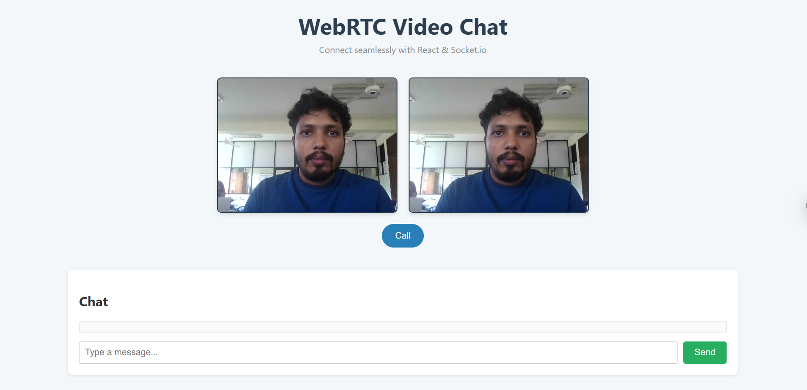

# WebRTC-Real-Time-Video-Conferencing-Application

A simple peer-to-peer video and text chat application demonstrating how to use WebRTC for media streaming and Socket.io for signaling and chat messaging. This project consists of two parts:

1. **Signaling Server** (Node.js + Express + Socket.io)
2. **Client Application** (React)

---

## Table of Contents

- [Features](#features)
- [Prerequisites](#prerequisites)
- [Getting Started](#getting-started)
  - [Clone Repository](#clone-repository)
  - [Signaling Server Setup](#signaling-server-setup)
  - [Client Application Setup](#client-application-setup)
- [Usage](#usage)
- [Project Structure](#project-structure)
- [Configuration](#configuration)
- [Contributing](#contributing)
- [License](#license)
- [Acknowledgments](#acknowledgments)

---

## Features

- **Peer-to-Peer Video & Audio Chat**  
  Seamless media streaming directly between clients without a central media server.

- **Real-Time Text Chat**  
  Exchange messages in parallel with audio/video streams.

- **Signaling Server**  
  Lightweight Node.js/Express server using Socket.io to coordinate WebRTC offer/answer and ICE candidate exchanges.

- **NAT Traversal via ICE**  
  Utilizes STUN servers for network address discovery, ensuring connectivity across NATs and firewalls.

- **Customizable Frontend**  
  Built with React; easily extend UI, configure STUN/TURN servers, or integrate additional features.

---

## How It Works

1. **Media Acquisition**  
   - The app requests permission for camera and microphone using `getUserMedia()`.  
   - Local media tracks are obtained and attached to the local video element.

2. **Peer Connection Setup**  
   - A new `RTCPeerConnection` is created with ICE server configuration (STUN).

3. **Signaling Exchange**  
   - **Offer**: Caller generates an SDP offer via `createOffer()`, sets it as local description, and emits it through Socket.io.  
   - **Answer**: Callee receives the offer, sets it as remote description, generates an SDP answer via `createAnswer()`, sets as local description, and sends back.

4. **ICE Candidate Gathering**  
   - As the peer connection discovers candidates, it emits `icecandidate` events. These are forwarded through the signaling server and added to the remote peer’s connection via `addIceCandidate()`.

5. **Media Negotiation & Streaming**  
   - Once both SDP and ICE negotiation completes, a secure DTLS/SRTP media channel is established, streaming audio/video between peers.

6. **Chat Messaging**  
   - Chat messages bypass WebRTC and use the same Socket.io signaling channel for exchange.

---

## Prerequisites

- [Node.js](https://nodejs.org/) (v14 or above)
- [npm](https://www.npmjs.com/) or [Yarn](https://yarnpkg.com/)
- Modern web browser with WebRTC support (Chrome, Firefox, Edge, etc.)

---

## Getting Started

### Clone Repository
```bash
git clone https://github.com/your-username/webrtc-video-chat.git
cd webrtc-video-chat
```

### Signaling Server Setup
1. Navigate to the project root (if not already there):
   ```bash
   cd webrtc-video-chat
   ```
2. Install server dependencies:
   ```bash
   npm install
   ```
3. Start the signaling server:
   ```bash
   npm start
   ```
   By default, the server listens on port `4000`. You can override this by setting the `PORT` environment variable.

### Client Application Setup
1. Open a new terminal, navigate into the `client` folder:
   ```bash
   cd client
   ```
2. Install client dependencies:
   ```bash
   npm install
   ```
3. Start the React development server:
   ```bash
   npm start
   ```
   The app will launch at `http://localhost:3000` by default.

---

## Usage

1. Open two separate browser windows or tabs.
2. In each, navigate to `http://localhost:3000`.
3. Grant camera and microphone permissions when prompted.
4. Click the **Call** button in one window to initiate a WebRTC offer.
5. The other window will automatically respond with an answer.
6. Once the connection is established, you will see each other’s video streams and can exchange chat messages in real time.

---

## Project Structure

```
webrtc-video-chat/
├── server/               # Signaling server
│   ├── index.js          # Express + Socket.io server code
│   └── package.json
├── client/               # React application
│   ├── src/
│   │   ├── App.js        # Main component with WebRTC logic
│   │   ├── App.css       # Styles
│   │   └── index.js
│   └── package.json
└── README.md
```

---

## Configuration

- **Signaling Server**
  - `PORT` (default: `4000`)
  - CORS origin is currently set to `*` for testing. Restrict this in production to your client domain.

- **React Client**
  - Default server URL is `http://localhost:4000`. To change, edit the `io()` initialization in `App.js`:
    ```js
    const socket = io("http://your-server-domain:4000");
    ```

---

## UI Preview



## Contributing

Contributions are welcome! Please open issues or submit pull requests against the `main` branch.

1. Fork the repository
2. Create your feature branch (`git checkout -b feature/YourFeature`)
3. Commit your changes (`git commit -m 'Add some feature'`)
4. Push to the branch (`git push origin feature/YourFeature`)
5. Open a Pull Request

---

## License

This project is licensed under the [MIT License](https://opensource.org/licenses/MIT).

---

## Acknowledgments

- [WebRTC API documentation](https://developer.mozilla.org/en-US/docs/Web/API/WebRTC_API)
- [Socket.io](https://socket.io/)
- [React](https://reactjs.org/)

